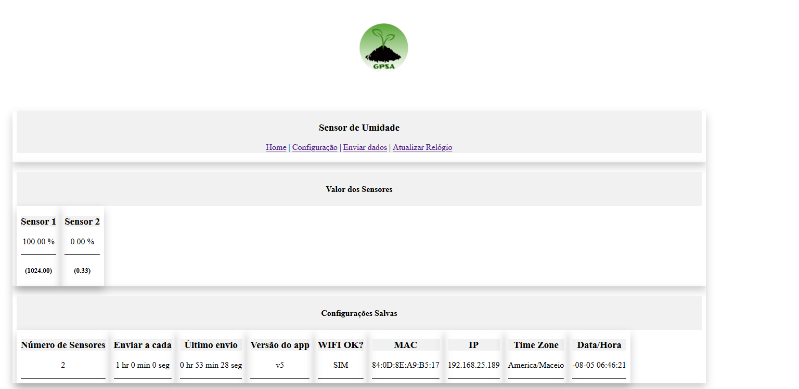
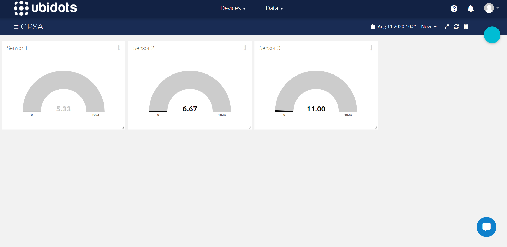
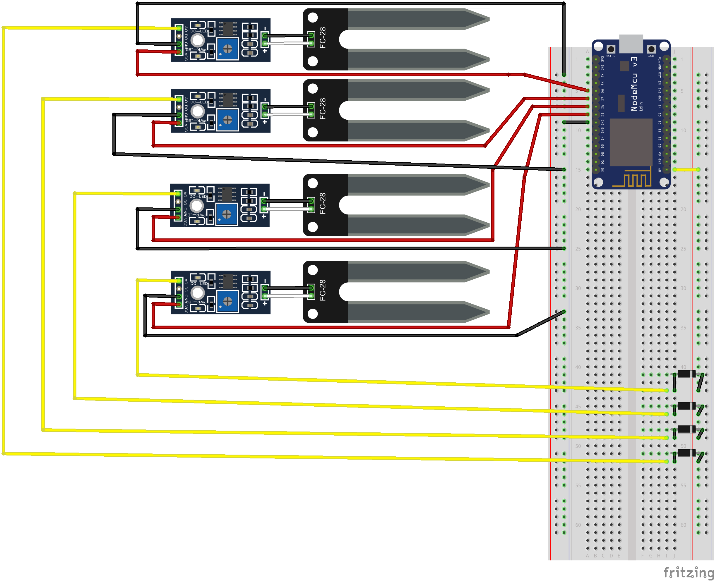
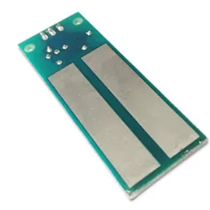
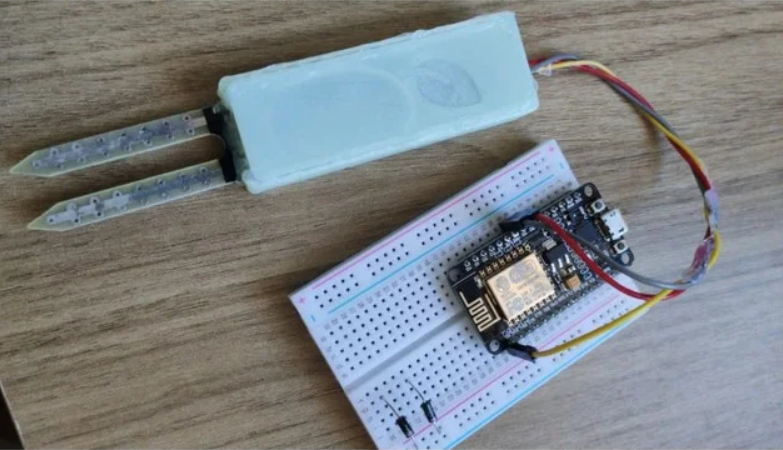

# Sensor Umidade

Projeto monitorar a umidade de solo de vários recipientes através de sensores capacitivos utilizando um único esp8266 controlador.

## Descrição

O GPSA necessitava de um mecanismo para controlar a temperatura de recipientes de pesquisa envolvendo lodo (esgoto) e minhocas.

Para atender a necessidade foi criado um sistema que envia para o servidor [ubidots] o valor dos sensores conectados no esp8266.
O sistema aceita até 8 sensores, que são controlados através das portas digitais (ligando-os e desligando-os), e configurados através do portal.



## Configuração

### WI-FI

A solução faz uso da *lib* [IotWebConf](https://github.com/prampec/IotWebConf/) para abrir um *portal captive*, que permite o manuseio e configuração da solução.

## Ubidots

A cada período (previamente cadastrada) as informações são enviadas para o servidor Ubidots. Para tal é necessário informar o token do usuário.

Para cada sensor é enviado o valor RAW (como lido do sistema) tendo como faixa 0~1023.

Importante destacar que é preciso fazer a calibração de cada sensor utilizado. No nosso caso fizemos o teste com o solo seco, úmido e saturado. Com estes valores foram criados os gráficos no portal do Ubidots.



### Conexões

A imagem abaixo apresenta o esquema de conexão com 4 sensores, que foi definido através dos pinos `int digitalPinsSoilMoisture[] = {14, 12, 13, 15, 2, 0, 4, 5};`;

.

A ordem dos pinos definida em `digitalPinsSoilMoisture` representa a posição de cada um dos sensores.

| Sensor | GPIO  |
| :----: | :---: |
|   1    |  14   |
|   2    |  12   |
|   3    |  13   |
|   4    |  15   |
|   5    |   2   |
|   6    |   0   |
|   7    |   4   |
|   8    |   5   |

Ver a definição dos pinos em [aqui](https://camo.githubusercontent.com/565088c2f27742a268695307938112ef42eee995/68747470733a2f2f692e737461636b2e696d6775722e636f6d2f79543468622e706e67).

## API / Exemplo básico

```c++
#include <Arduino.h>
#include <SoilMoistureSensor.h>
#include <SoilMoistureManager.h>

int digitalPinsSoilMoisture[] = {14,12,13,15, 2, 0, 4, 5};
SoilMoistureManager *smm;
int count = 2; // Dois sensores de umidade

setup(){
  smm = new SoilMoistureManager(digitalPinsSoilMoisture, count);
  smm->printStatus();
}

loop(){
  for (unsigned i = 0 ; i < smm->getQtdSensors(); i++){
    char sensor[20], sensorRawValue[20];
    sprintf(sensor,"Sensor_%d", (i));
    sprintf(sensorRawValue,"Sensor_%d_Raw", (i));
    SoilMoistureSensor s = smm->getSensores()[i];
    float value = s.getMoistureValue();
    float rawValue = s.getMoistureRawValue();
    Serial.printf("%s = %f [%f]\n", &sensor, value, rawValue);
  }
  delay(5000);
}
```

## Sensores testados

### GBK 



- Fazer download do [case](https://www.thingiverse.com/thing:4567970) para impressora 3D.

### Sensor Higrômetro



- Fazer download do [case](https://www.thingiverse.com/thing:4562128) para impressora 3D.

---
GPSA: Grupo de Saneamento Ambiental.

